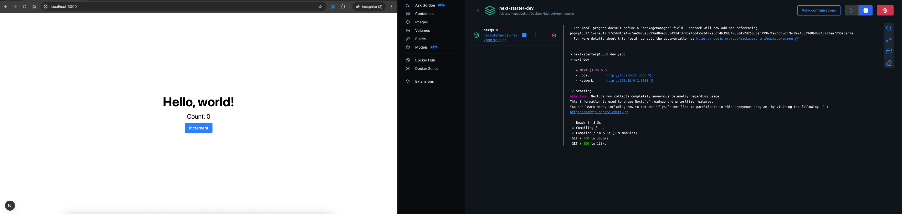
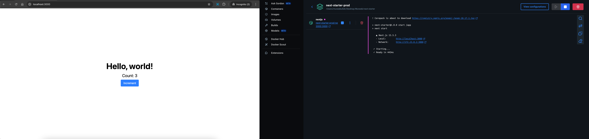
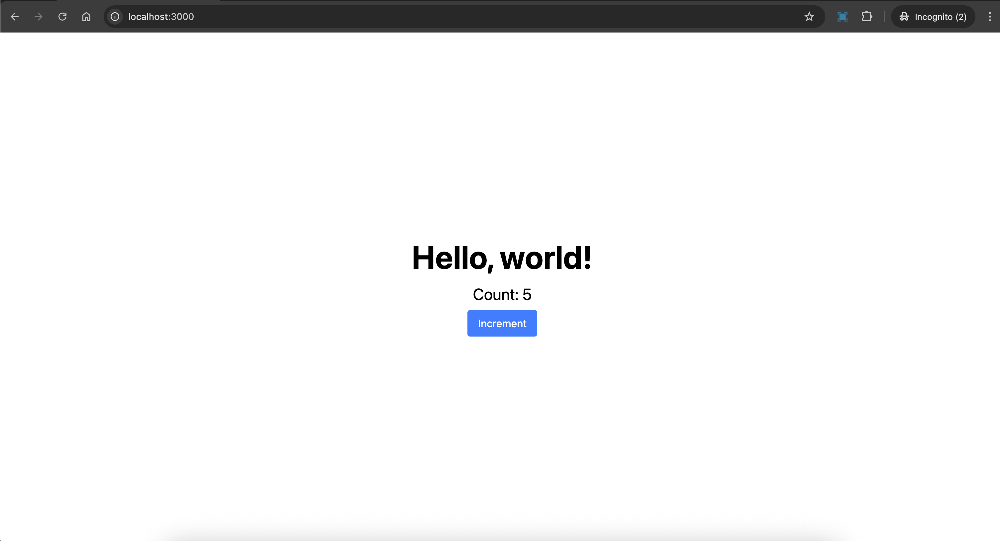
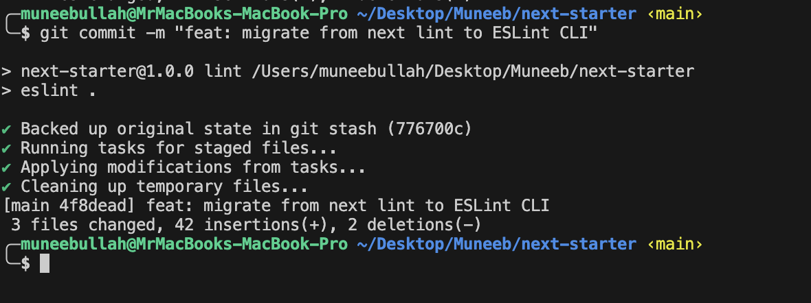

---

<p align="center">
  
</p>

<h1 align="center">NextJS Dockerised</h1>

<p align="center">
  A modern, production-ready <strong>Next.js</strong> starter template powered by <strong>TypeScript</strong>, <strong>Tailwind CSS</strong>, and fully <strong>Dockerised</strong> for seamless development and deployment.
</p>

---

## Features

* Next.js 15.5.3 with latest security patches
* React 19 with modern features
* TypeScript for type safety
* Tailwind CSS for styling
* Multi-stage Docker builds for development and production
* Prettier for code formatting
* ESLint for code quality
* Husky for Git hooks with commitlint
* Comprehensive GitHub Actions workflows
* Security scanning with CodeQL and Trivy
* Automated dependency updates

---

## Getting Started

This project supports both Docker-based and local development workflows.

### Prerequisites

* [Docker](https://www.docker.com/) and [Docker Compose](https://docs.docker.com/compose/)
* [Node.js](https://nodejs.org/) 20+ (for local development)
* [pnpm](https://pnpm.io/) package manager

---

## Docker Development

### Environment Setup

Create environment files for different environments:

```bash
# Development environment
cp .env.example .env.dev

# Production environment  
cp .env.example .env.prod
```

### Development with Docker

Start the development environment with hot reload:



```bash
pnpm run docker:dev
```

Build development image:

```bash
pnpm run docker:dev:build
```

### Production Deployment

Deploy to production:



```bash
pnpm run docker:prod
```

Build production image:

```bash
pnpm run docker:prod:build
```

### Docker Management

Stop containers:

```bash
pnpm run docker:dev:down    # Stop development
pnpm run docker:prod:down   # Stop production
```

Clean up Docker system:

```bash
pnpm run docker:clean
```

---

## Local Development



Install dependencies:

```bash
pnpm install
```

Start development server:

```bash
pnpm run dev
```

Build for production:

```bash
pnpm run build
```

Start production server:

```bash
pnpm run start
```

---

## Code Quality

### Linting

Run ESLint to check code quality:

```bash
pnpm run lint
```

### Type Checking

Run TypeScript compiler to verify type safety:

```bash
pnpm run type-check
```

### Formatting

Automatically format your code with Prettier:

```bash
pnpm run format
```

---

## Git Hooks

This project uses Husky for Git hooks with commitlint for conventional commits.

Hooks are automatically installed when you run `pnpm install`. The following hooks are configured:

* **pre-commit**: Runs ESLint and Prettier on staged files
* **commit-msg**: Validates commit messages follow conventional commit format

Example commit message format:

```
feat: add new user authentication feature
fix: resolve login redirect issue
docs: update API documentation
```

## GitHub Actions



This repository includes comprehensive CI/CD workflows that run automatically on pull requests and pushes.

### Workflows Overview

**Lint Workflow**: Runs ESLint and TypeScript checks on every PR and push to main/develop branches.

**Docker Workflow**: Builds and tests both development and production Docker images to ensure containerization works correctly.

**Build & Test Workflow**: Tests the application across multiple Node.js versions (20, 22) to ensure compatibility.

**Security Workflow**: Performs security audits, CodeQL analysis, and Trivy vulnerability scanning to maintain security standards.

**Dependency Update Workflow**: Monitors for dependency updates and creates automated pull requests for non-breaking changes.

**Deploy Workflow**: Handles deployment to staging and production environments with proper environment-specific configurations.

**CI Pipeline Workflow**: Runs a quick validation pipeline for fast feedback on code changes.

### Automatic Feedback

When workflows fail, the system automatically:
* Comments on pull requests with specific failure details
* Provides links to workflow logs for debugging
* Suggests fixes for common issues

---

## Project Structure

```
/app                    - Next.js app directory with routing
/app/api/health         - Health check endpoint for Docker
/components             - Reusable React components
/context               - Global React context providers
/css                    - Global styles and Tailwind configuration
/hooks                  - Custom React hooks
/lib                    - Helper libraries and utilities
/types                  - TypeScript type definitions
/utils                  - Utility functions
.github/workflows       - GitHub Actions CI/CD workflows
.husky                  - Git hooks configuration
```

---

## Available Scripts

### Development
```bash
pnpm run dev              # Start development server
pnpm run build           # Build for production
pnpm run start           # Start production server
pnpm run lint            # Run ESLint
pnpm run format          # Format code with Prettier
pnpm run type-check      # Run TypeScript type checking
```

### Docker Commands
```bash
pnpm run docker:dev              # Start development container
pnpm run docker:dev:build        # Build development image
pnpm run docker:dev:down         # Stop development container
pnpm run docker:prod            # Start production container
pnpm run docker:prod:build      # Build production image
pnpm run docker:prod:down       # Stop production container
pnpm run docker:clean           # Clean up Docker system
```

### Maintenance
```bash
pnpm run upgrade         # Update dependencies
```

---

## License

This project is licensed under the [MIT License](./LICENSE).
